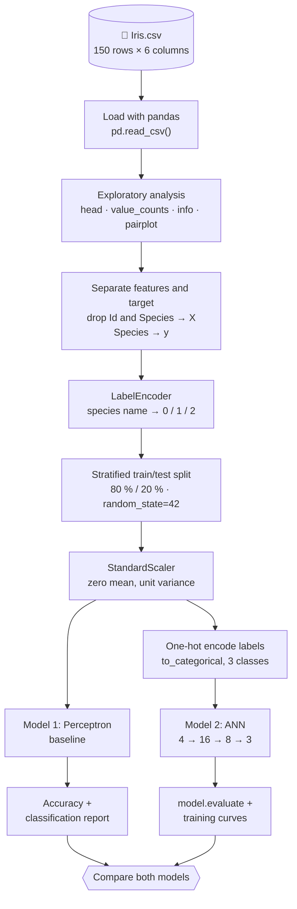
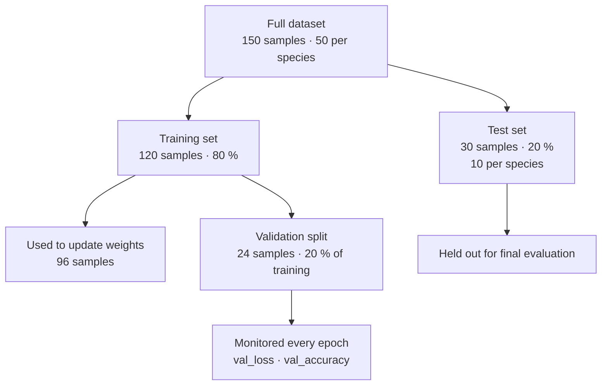
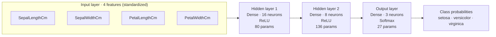
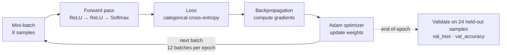

# 🌸 Iris Flower Classification with an Artificial Neural Network

A hands-on deep-learning project that classifies **Iris flowers into three species** from four petal/sepal measurements. It builds a **Perceptron baseline** with scikit-learn and then a **multi-layer ANN** with TensorFlow/Keras, and compares the two on the same data split.


---

## 📑 Table of Contents

1. [Results at a Glance](#-results-at-a-glance)
2. [Dataset](#-dataset)
3. [Project Structure](#-project-structure)
4. [End-to-End Pipeline (Diagram)](#-end-to-end-pipeline)
5. [Exploratory Data Analysis](#-exploratory-data-analysis)
6. [Data Split Strategy (Diagram)](#-data-split-strategy)
7. [Model 1: Perceptron Baseline](#-model-1-perceptron-baseline)
8. [Model 2: Artificial Neural Network (Diagram)](#-model-2-artificial-neural-network)
9. [How One Training Step Works (Diagram)](#-how-one-training-step-works)
10. [Results in Detail](#-results-in-detail)
11. [Getting Started](#-getting-started)
12. [Known Limitations & Next Steps](#-known-limitations--next-steps)
13. [Author](#-author)

---

## 🏁 Results at a Glance

| Model | Library | Test Accuracy | Notes |
|-------|---------|:-------------:|-------|
| Perceptron (baseline) | scikit-learn | **86.7 %** (26/30) | Single-layer linear classifier |
| ANN (4 → 16 → 8 → 3) | TensorFlow / Keras | **96.7 %** (29/30) | 243 trainable parameters, 100 epochs |

> The test set contains only 30 samples (10 per species), so one extra mistake changes accuracy by about 3.3 points. Treat these numbers as indicative rather than definitive (see [Known Limitations](#-known-limitations--next-steps)).

---

## 📊 Dataset

The classic **Iris dataset** (`Iris.csv`): 150 flowers, 50 per species, with no missing values.

| Column | Type | Description |
|--------|------|-------------|
| `Id` | int | Row number (**dropped** before training) |
| `SepalLengthCm` | float | Sepal length in cm (4.3 – 7.9) |
| `SepalWidthCm` | float | Sepal width in cm (2.0 – 4.4) |
| `PetalLengthCm` | float | Petal length in cm (1.0 – 6.9) |
| `PetalWidthCm` | float | Petal width in cm (0.1 – 2.5) |
| `Species` | string | **Target**: `Iris-setosa`, `Iris-versicolor`, `Iris-virginica` |

The classes are perfectly balanced, so plain accuracy is a fair metric here.

---

## 🗂 Project Structure

```text
iris_ann/
├── dl.ipynb          # Main notebook: EDA, preprocessing, Perceptron, ANN, evaluation
├── Iris.csv          # Dataset (150 rows × 6 columns)
├── assets/           # Figures used in this README
│   ├── pairplot.png
│   └── training_curves.png
└── README.md
```

---

## 🔄 End-to-End Pipeline



**Reading the diagram**

| Step | What happens | Why it matters |
|------|--------------|----------------|
| **Load** | `Iris.csv` is read into a pandas DataFrame. | Gives a tabular structure for inspection and slicing. |
| **Explore** | `head()`, `value_counts()`, `info()` and a seaborn pairplot. | Confirms 150 rows, balanced classes, no nulls, and shows which features separate the species. |
| **Features / target** | `Id` and `Species` are removed from `X`; `Species` becomes `y`. | `Id` is just a row counter, so keeping it would let a model learn file order instead of flower traits. |
| **Label encoding** | `LabelEncoder` maps `Iris-setosa → 0`, `Iris-versicolor → 1`, `Iris-virginica → 2`. | Models need numbers, not strings. |
| **Stratified split** | 80 % train, 20 % test, with equal species proportions in both. | Prevents an unlucky split with too few examples of one class. |
| **Scaling** | `StandardScaler` standardizes each feature. | Gradient-based models train faster and more stably when features share a scale. |
| **Branch** | The same scaled data feeds both models. | A like-for-like comparison. |
| **One-hot encoding** | Only the ANN needs `[1,0,0]`, `[0,1,0]`, `[0,0,1]` labels. | Required by the softmax output and categorical cross-entropy loss. |

---

## 🔍 Exploratory Data Analysis

<p align="center">
  
</p>

*Pairplot of the four features (the `Id` column is left out here for clarity). Diagonal plots show each feature's distribution per species.*

**What the plot tells us**

- 🟦 **Setosa** is clearly separated from the others, especially on petal length and petal width. Any reasonable classifier should find it easy.
- 🟧🟩 **Versicolor and virginica overlap** in the sepal measurements and partly in the petal measurements. This is where most mistakes happen.
- **Petal length and petal width** are the most discriminative features. Sepal width is the least.

---

## ✂️ Data Split Strategy



**Reading the diagram**

- `train_test_split(..., test_size=0.2, random_state=42, stratify=y_int)` creates the **120 / 30** split. `stratify` keeps the species balanced (10 per class in the test set) and `random_state=42` makes the split reproducible.
- Inside `model.fit(..., validation_split=0.2)`, Keras sets aside **24 of the 120 training samples** as a validation set. That leaves **96 samples** for weight updates, which is why training shows **12 steps per epoch** (96 ÷ batch size 8).
- The **test set** is only used at the end, so it gives an honest estimate of performance on unseen flowers.

---

## ⚙️ Model 1: Perceptron Baseline

A single-layer linear classifier from scikit-learn, used as a reference point.

```python
Perceptron(max_iter=1000, random_state=42)
```

It learns one linear decision boundary per class, so it cannot model curved boundaries. That limitation shows up on the overlapping versicolor/virginica region.

---

## 🧠 Model 2: Artificial Neural Network



```python
model = Sequential([
    Dense(16, input_dim=4, activation='relu'),
    Dense(8,  activation='relu'),
    Dense(3,  activation='softmax')
])
model.compile(optimizer='adam',
              loss='categorical_crossentropy',
              metrics=['accuracy'])
history = model.fit(X_train_scaled, y_train_cat,
                    epochs=100, batch_size=8, validation_split=0.2)
```

**Reading the diagram**

| Layer | Shape | Activation | Parameters | Role |
|-------|-------|-----------|:----------:|------|
| Input | 4 | none | 0 | Receives the four standardized measurements. |
| Hidden 1 | 16 | ReLU | 4×16 + 16 = **80** | Learns combinations of the raw features. |
| Hidden 2 | 8 | ReLU | 16×8 + 8 = **136** | Compresses these into higher-level patterns. |
| Output | 3 | Softmax | 8×3 + 3 = **27** | Turns scores into three probabilities that sum to 1. |
| **Total** | | | **243** | |

**Design choices**

- **ReLU** in the hidden layers adds the non-linearity that the Perceptron lacks, which is what lets the network curve its decision boundaries.
- **Softmax + categorical cross-entropy** is the standard pairing for multi-class classification with one-hot labels. The predicted class is the output neuron with the highest probability.
- **Adam** adapts the learning rate per weight and works well with little tuning.
- The tapering shape **16 → 8 → 3** gradually reduces the representation down to the three classes.

---

## 🔁 How One Training Step Works



**Reading the diagram**

1. A **mini-batch of 8 samples** goes through the network (forward pass) and produces class probabilities.
2. The **loss** measures how far those probabilities are from the true one-hot labels.
3. **Backpropagation** computes how much each weight contributed to the error.
4. **Adam** nudges every weight to reduce the loss.
5. This repeats for **12 batches = 1 epoch**. After each epoch the model is scored on the validation samples, without updating weights. The whole process runs for **100 epochs**.

---

## 📈 Results in Detail

### Perceptron: classification report (test set, 30 samples)

| Class | Precision | Recall | F1-score | Support |
|-------|:---------:|:------:|:--------:|:-------:|
| 0: Iris-setosa | 0.83 | 1.00 | 0.91 | 10 |
| 1: Iris-versicolor | 0.88 | 0.70 | 0.78 | 10 |
| 2: Iris-virginica | 0.90 | 0.90 | 0.90 | 10 |
| **Accuracy** | | | **0.87** | 30 |

Versicolor is the weak spot (recall 0.70): three of its ten test flowers were assigned to another class, which matches the overlap seen in the pairplot.

### ANN: training curves

<p align="center">
  
</p>

*Re-plotted from the per-epoch values logged in the notebook, with legends and axis labels added.*

| Epoch | Train acc. | Val. acc. | Train loss | Val. loss |
|:-----:|:----------:|:---------:|:----------:|:---------:|
| 1 | 0.323 | 0.292 | 1.056 | 1.085 |
| 10 | 0.688 | 0.583 | 0.642 | 0.708 |
| 30 | 0.854 | 0.875 | 0.382 | 0.429 |
| 50 | 0.906 | 0.958 | 0.291 | 0.316 |
| 100 | 0.958 | 1.000 | 0.095 | 0.056 |

**Interpretation**

- Both curves start near **chance level** (about 33 % for three balanced classes) and climb steadily, so the network is genuinely learning.
- Train and validation curves **move together** with no widening gap, so there is no sign of serious overfitting.
- Validation accuracy ending *above* training accuracy is normal here: the validation set is tiny (24 samples), and Keras reports training accuracy as an average over the epoch while the weights are still changing.
- The loss is **still decreasing at epoch 100**, so the model has not fully converged.

### Final test performance

| Metric | Perceptron | ANN |
|--------|:----------:|:---:|
| Test accuracy | 0.867 | **0.967** |
| Test loss | n/a | 0.135 |

The ANN gains about **10 percentage points** over the baseline. Adding hidden layers with non-linear activations helps most on the versicolor/virginica boundary.

---

## 🚀 Getting Started

### Prerequisites

- Python 3.9 – 3.11 (the notebook was developed on Python 3.11)
- `pip` and a Jupyter environment

### Installation

```bash
# 1. Clone the repository
git clone https://github.com/Ayush-aw4/iris_ann.git
cd iris_ann

# 2. (Recommended) create a virtual environment
python -m venv venv
source venv/bin/activate        # Windows: venv\Scripts\activate

# 3. Install dependencies
pip install numpy pandas matplotlib seaborn scikit-learn tensorflow jupyter
```

### Run

```bash
jupyter notebook dl.ipynb
```

Then choose **Kernel → Restart & Run All**. The notebook expects `Iris.csv` in the same folder. Training takes well under a minute on a normal CPU.

> **Windows note:** TensorFlow 2.11 and later does not use the GPU on native Windows. The notebook prints a warning about this and simply runs on the CPU, which is plenty for a dataset this small. WSL2 is the route if you want GPU training later.

### Notebook walkthrough

| Section | What it does |
|---------|--------------|
| Imports | NumPy, pandas, matplotlib, seaborn, scikit-learn, TensorFlow/Keras |
| Load & inspect | `read_csv`, `head`, `value_counts`, `info`, pairplot |
| Preprocess | Drop `Id`, label-encode the species, stratified split, standardize |
| Perceptron | Fit, predict, accuracy, classification report |
| ANN | One-hot labels, build, compile, train 100 epochs, evaluate, plot curves |

---

## 🔧 Known Limitations & Next Steps

**Worth fixing**

- [ ] **Scale the test set with the training statistics.** The notebook currently calls `scaler.fit_transform(X_test)`, which re-fits the scaler on the test data. The correct pattern is `scaler.transform(X_test)`, so that the test set is standardized with the mean and standard deviation learned from the training set only.
- [ ] **Set random seeds for the ANN.** Only scikit-learn uses `random_state=42`; adding `tf.keras.utils.set_random_seed(42)` makes the ANN numbers repeatable. Without it, results shift slightly from run to run.
- [ ] **Add a `.gitignore`.** The `.ipynb_checkpoints/` folder is an auto-generated copy of the notebook and does not belong in version control.

**Ideas to extend the project**

- [ ] Use **stratified k-fold cross-validation** instead of a single 30-sample test set for a more reliable accuracy estimate.
- [ ] Plot a **confusion matrix** (`confusion_matrix` is already imported) for both models.
- [ ] Add **early stopping** and try **Dropout** (already imported but unused) to see whether it changes the training behavior.
- [ ] Compare with other classifiers (logistic regression, SVM, random forest, k-NN).
- [ ] Add a `requirements.txt` with pinned versions.
- [ ] Save the trained model (`model.save(...)`) and add a small prediction script or demo app.

---

## 👤 Author

**Ayush Awchar**
GitHub: [@Ayush-aw4](https://github.com/Ayush-aw4)

If this project helped you, consider giving it a ⭐.
